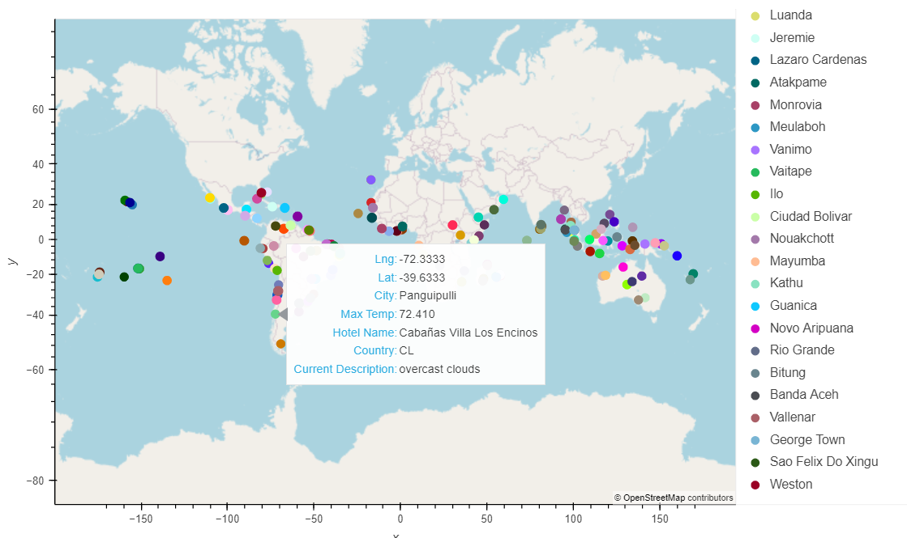
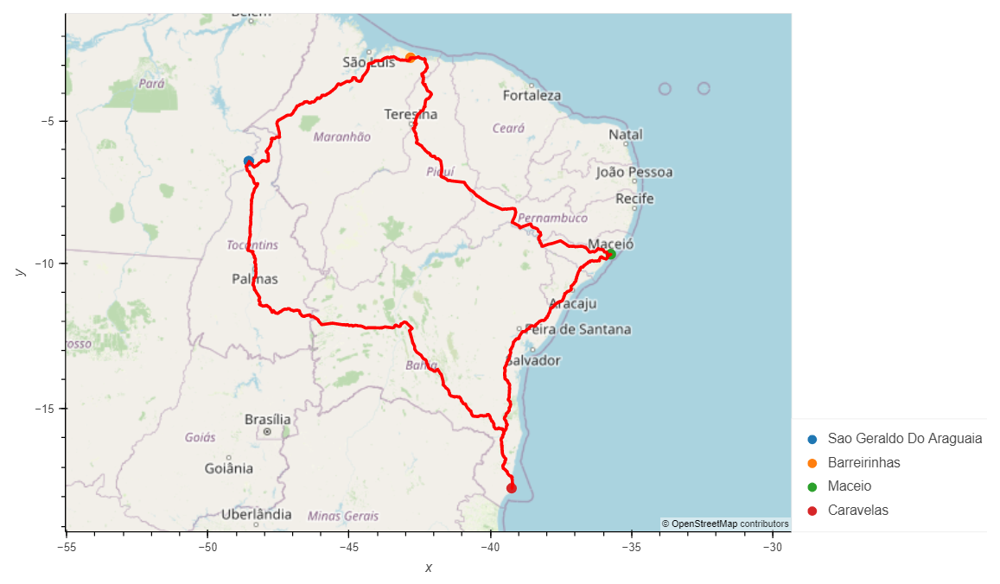

# World_Weather_Analysis

## Project Overview
We were tasked with creating the PlanMyTrip app in order to poorvide customers the opportunity to input desired temperatures and then identify potential travel destinations that met those desires. This app then gave these customers nearby hotels for each of the cities as well as a path to travel between each city on the trip. In order to create this we needed to find destinations, retrieve their weather data, find nearby hotels, and plot the chosen cities and travel route for the trip.

## Retrieving Weather Data
We generated 2,000 random latitues and longitudes and retrieved the nearest city to those coordinates. Then we took those cities and gathered their current weather description by calling the OpenWeatherMap API. From this API we pulled the maximum temperature, percent humidity, percent cloudiness, wind speed and weather description for each city we generated and created a DataFrame also including city, country, latitude, and longitude. Then we exported the DataFrame as a CSV file named [WeatherPy_Database.csv](https://github.com/trevoriwen/World_Weather_Analysis/blob/3a3328a0d76279eab786b7d094ed207cd1578214/Weather_Database/WeatherPy_Database.csv) to be used to create a customer travel destinations map.

## Creating a Customer Travel Destinations Map
For this deliverable we asked the customer to input their preferred min and max temperature to narrow their destination options from the WeatherPy_Database. We then created another DataFrame called [WeatherPy_vacation.csv](https://github.com/trevoriwen/World_Weather_Analysis/blob/3a3328a0d76279eab786b7d094ed207cd1578214/Vacation_Search/WeatherPy_vacation.csv) that took the cities in the narrowed search and found the nearest hotel to that city and removed any that didn't have a near by hotel. We also plotted the cities in WeatherPy_vacation.csv on a map that highlighted the city name, country, and weather description using Geoviews.

## Creating a Travel Itinerary Map
For the next deliverable we created a travel map for a trip through 4 cities in Brazil. To do this, we plotted the 4 cities on a map using Geoviews that showed Hotel Name along with the country and current description. We then pulled a list of the coordinates routing the driving path for the 4 city trip using the Geoapify Routing API. We then used Geoviews again to plot those coordinates as a line grpah on top of the map highlighting the 4 Brazil cities.

